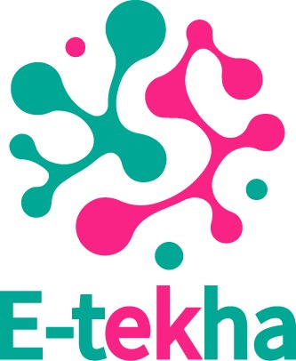

# E-tekha · Página de Presentación de la empresa E-thekha (en construcción)

**E-tekha** es una empresa emergente de tecnologías de la información orientada a la transformación digital de organizaciones productivas y solidarias. Este repositorio contiene una **página web básica** creada como parte de un proceso de **aprendizaje práctico** en desarrollo web.

---

## 🎯 Objetivo del proyecto

Este sitio ha sido desarrollado con el fin de practicar:

- 📄 Estructuración HTML5 moderna
- 🎨 Diseño visual con **Bootstrap 5.0.2**
- 📐 Personalización con CSS
- 🧠 Aplicación de principios de identidad visual y comunicación digital
- 🚀 Preparación para futuros aprendizajes en desarrollo web (formularios, scripts, animaciones, etc.)

---

## 🛠️ Tecnologías utilizadas

- HTML5
- Bootstrap 5.0.2 (CDN)
- CSS personalizado
- Visual Studio Code

---

## 🧪 Enfoque educativo

Este sitio es parte de una **práctica personal con fines educativos**, y se irá mejorando progresivamente con cada nuevo tema abordado en clase. Se busca desarrollar un portafolio profesional basado en una idea real de emprendimiento digital.

---

## 📁 Estructura del proyecto

E-tekha/
├── index.html ← Página principal
├── css/
│ └── style.css ← Estilos personalizados
├── img/
│ └── logo_etekha_rea.jpeg
│ └── fondo-hero.jpg (opcional)

---

## 🚧 Estado del proyecto

✅ Primera versión completada.  
🔜 Se irán incorporando formularios, enlaces, interacciones y nuevas secciones a medida que avance el aprendizaje.

---

## 🙌 Créditos

Este proyecto es desarrollado por [Mónica Rea], como parte del curso de Lenguajes WEB.  
**Docente:** [Tecnologo, Darwin Chamba]  
